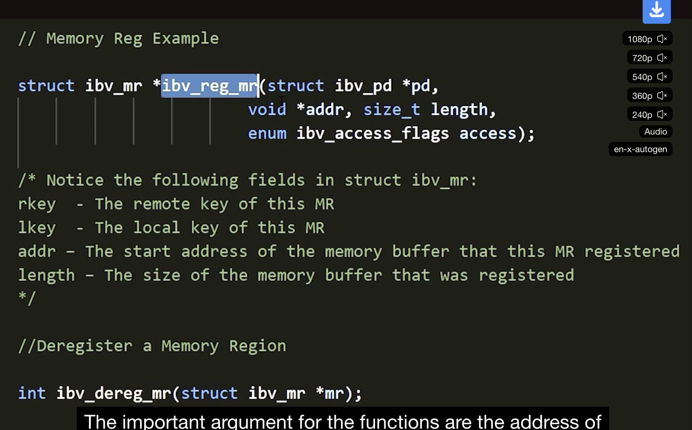

# Unit 14 - 17

Unit 14 - Memory Registration

how to register memory?

<figure><figcaption></figcaption></figure>

address buffer&#x20;

access\_flags

in return - you get memory region ibv\_mr with rkey and lkey fields - transition handlers used by hardware when accessing the memory region both locally and remotely

MR - a control path operation...

hapenning bgn of app... deregister memory

ibv\_dereg\_mr (deregister memory) with memory region received from the app

Unit. 15 - RDMA Send Request

send work request - post it to send queue

buffer to send, and type of operation

depending of type of operation - sometimes specify additional parameter

send queue - considered outstanding until hardware...

and post it all the compmletion queue

in order to specify buffer for sending, should have scattered gather entry - ibv\_sge

<figure><figcaption></figcaption></figure>

once work request is ready - ibv\_post\_s

<figure><figcaption></figcaption></figure>

if want to use atomic operation - provide additional values - eg. values to compare and swap number

Unit 16 - RDMA Receive Request

how receive msg in RDMA

first allocate buffer for h data to be placed int

then create receive work request to be received from received queue

... send those data ot the buffer

time work completion is generated, the request is considered outstanding, and shoudlnt access those receive buffer

<figure><figcaption></figcaption></figure>

wr param include wr ID, scatter gather element list...

<figure><figcaption></figcaption></figure>

both recv and send .. spport work request?

work request list by using the \*next parameter

Unit 17 - Request Completions

&#x20;howt o check if request is completed

when hardware complete work request - generate completion gqueue entry inside the cmpletion queue&#x20;

the content of work completion depends on type of request and status

eg.&#x20;

send + reliabile transport - data passed to tanother end and return successfully

..

eg. unreliable transport. only mean the data will be sent successfully, adnd may not reach destionation

..

for receive wr - means the msg is written by one of the receive buffer - if smaller, the rests of the buffer remain unchanged

howt o check completion queue?

1. ibr\_poll\_cq
2. the status of completion... .png>) &#x20;

depends on status - other field will be filled, eg. err field...

typical completion statuses:

<figure><figcaption></figcaption></figure>

